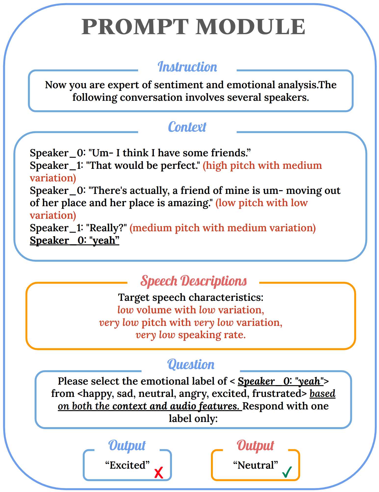

# VoiceERC

[](https://paperswithcode.com/sota/emotion-recognition-in-conversation-on?p=2407-21315)

	
[](https://paperswithcode.com/sota/emotion-recognition-in-conversation-on-meld?p=2407-21315)


#### Abstract: 
We address the limitation of LLMs in processing audio inputs by translating speech characteristics into natural language descriptions. Our method integrates these descriptions into text prompts, enabling LLMs to perform multimodal emotion analysis without architectural modifications or addition. 

 Our LLM-finetuning experiments show that incorporating speech descriptions yields a more than 2 percentage point increase in average weighted F1 score on IEMOCAP (from 70.111% to 72.596%).


<p align="center">
    
</p>

Figure 1: LLM Prompt Template for Emotion Detection: the last bold sentence with an underline is the target utterance. The orange part denotes outputs with added speech descriptions. This structured template integrates textual context and speech characteristics to guide the LLM in performing multimodal emotion analysis.

Paper link: https://arxiv.org/abs/2407.21315


## Extract Speech Features

#### Data Directory
To run our preprocessing codes directly, please download data and put into the data drirectory.

#### Run Extraction Code
```
# 1. extract basic speech features
python feature_utils/extract_audio_feature.py

# 2. post-process the basic features (meld)
python feature_utils/postprocess_audio_feature_meld.py
# 2. or post-process the basic features (iemocap)
python feature_utils/postprocess_audio_feature_iemocap.py

# 3. test the extracted features (adjust variables (dataset, classes) inside the main function)
python model_audio_features.py
```

#### Use Existing Features
You can also use the existing feature files in the speech_features folder.

## LLM Modeling
This is an ongoing project, and we will release the training code once we update our models and finish all the experiments. We build our project on the foundation of [InstructERC](https://github.com/LIN-SHANG/InstructERC).